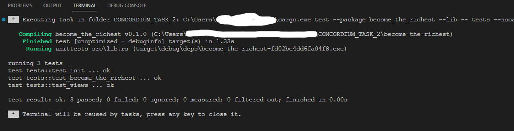
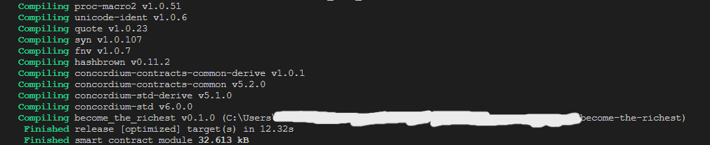
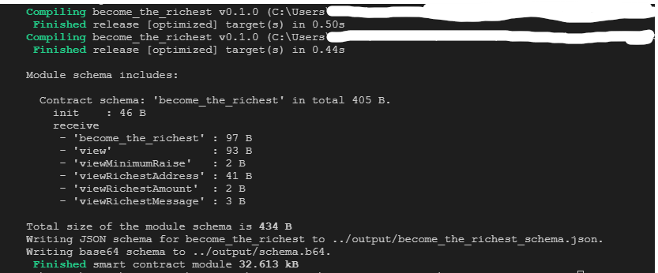
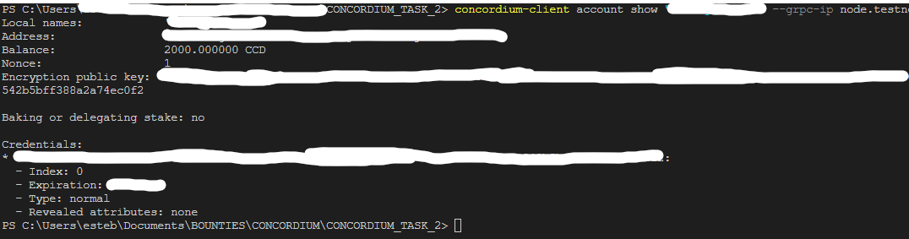
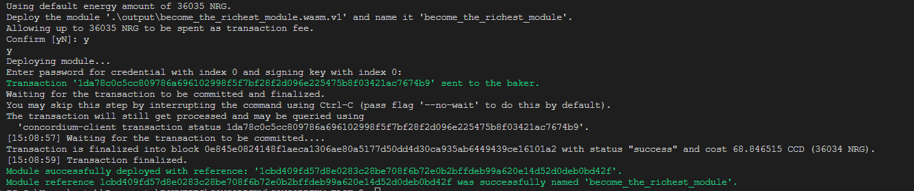
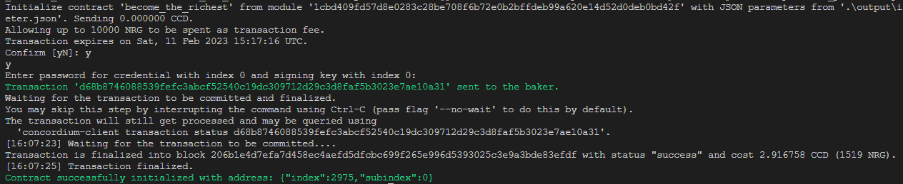
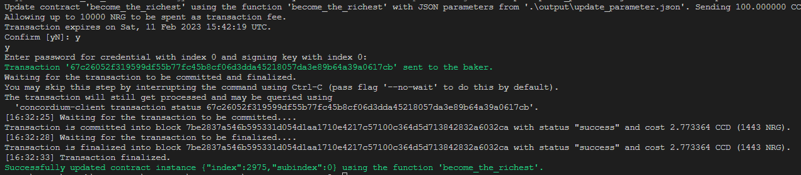
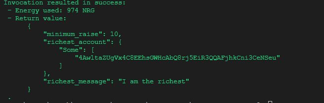
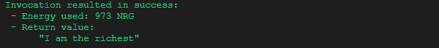

### Hackathon: Concordium Hackathon - The Future of Identity
# TASK 2: Deploy Your First Smart Contract

Gitcoin issue [29742](https://gitcoin.co/issue/29742)
Concordium Account address on mainnet
Identity provider: Digital Trust Solutions

Concordium Mainnet address: `4Fo1erxUgLt7wDvaoUgxxBbV3rquCWZmnzGnDA2DUzv6FFqAKk`

# Smart contract 

## Description

[become-the-richest](./become-the-richest/src/lib.rs) 
is a smart contract that holds in its state the account that paid highest amount of CCD to the contract and let's it set a message.

When a new amount is received it check that it's over a minimal raise
in euro cent:

$min_{raise} = 10\% \space prevRichestEuroCents$

Transfers CCDs to previous richest account and sets the new message. 

## State vatiables:
```rust
pub struct State {
    /// richest account
    richest_account: Option<AccountAddress>,
    /// richest message
    richest_message: String,
    /// min raise in euro_cent
    minimum_raise: u64,
}
```

## Functions

```rust
#[receive(
    contract = "become_the_richest",
    name = "become_the_richest",
    payable,
    mutable,
    error = "BecomeTheRichestAddressError",
    parameter = "String"
)]
fn become_the_richest<S: HasStateApi>(
    ctx: &impl HasReceiveContext,
    host: &mut impl HasHost<State, StateApiType = S>,
    amount: Amount,
) -> Result<(), BecomeTheRichestErrors> {
    ...CODE...
}
```

## Views 
Added views to check state variables.

```rust
/// View function that returns the content of the state.
#[receive(contract = "become_the_richest", name = "view", return_value = "State")]
fn view<'b, S: HasStateApi>(
    _ctx: &impl HasReceiveContext,
    host: &'b impl HasHost<State, StateApiType = S>,
) -> ReceiveResult<&'b State> {
    Ok(host.state())
}

/// ViewRichestAddress  function that returns the highest bid which is the balance of
/// the contract
#[receive(
    contract = "become_the_richest",
    name = "viewRichestAddress",
    return_value = "Address"
)]
fn view_richest_address<S: HasStateApi>(
    _ctx: &impl HasReceiveContext,
    host: &impl HasHost<State, StateApiType = S>,
) -> ReceiveResult<Option<AccountAddress>> {
    Ok(host.state().richest_account)
}

... MORE VIEWS ..
```

## Tests

Tests are located here line 182:

```rust
[concordium_cfg_test]
mod tests {
    ... TESTS HERE ...
}
```

Test results:



# Smart contract deployement

## Build 
In contract dir:
```console
PS>  mkdir ../output 
PS> cargo concordium build --out ../output/become_the_richest_module.wasm.v1
```


and schema files:

```console
cargo concordium build --schema-out ../output/schema.bin --schema-json-out ../output/ --schema-base64-out ../output/schema.b64 --out ..\output\test.wasm.v1
```


Files:

```console
+---become-the-richest
    +---src
        => lib.rs <= 
        [contract source]
    +---target
        +---concordium
            ...
        +---debug
            ...
+---media
+---output
    => become_the_richest_module.wasm.v1 <= 
    [contract wasm]
    => become_the_richest_schema.json <= 
    [contract schemas json]
    => schema.[b64|bin <= 
    [contract schemas in bin and base 64]
```

# Deployment

From workspace folder:

Check your testnet account
```console
PS> concordium-client account show "<your address or localname here>" --grpc-ip node.testnet.concordium.com --grpc-port 10000

Local names:            '<local name>'
Address:                <Address>
Balance:                2000.000000 CCD
Nonce:                  1
Encryption public key:  <PK>

Baking or delegating stake: no

Credentials:
* xxx.xxx:
  - Index: 0
  - Expiration: <Month> <Year>
  - Type: normal
  - Revealed attributes: none
```



Finally deploy:

```console
concordium-client module deploy .\output\become_the_richest_module.wasm.v1 --name become_the_richest_module --sender <your address or localname here> --grpc-ip node.testnet.concordium.com --grpc-port 10000
```

Results
```
Using default energy amount of 36035 NRG.
Deploy the module '.\output\become_the_richest_module.wasm.v1' and name it 'become_the_richest_module'.
Allowing up to 36035 NRG to be spent as transaction fee.
Confirm [yN]: y
y
Deploying module...
Enter password for credential with index 0 and signing key with index 0: 
Transaction '1da78c0c5cc809786a696102998f5f7bf28f2d096e225475b8f03421ac7674b9' sent to the baker.
Waiting for the transaction to be committed and finalized.
You may skip this step by interrupting the command using Ctrl-C (pass flag '--no-wait' to do this by default).
The transaction will still get processed and may be queried using
  'concordium-client transaction status 1da78c0c5cc809786a696102998f5f7bf28f2d096e225475b8f03421ac7674b9'.
[15:08:57] Waiting for the transaction to be committed....
Transaction is finalized into block 0e845e0824148f1aeca1306ae80a5177d50dd4d30ca935ab6449439ce16101a2 with status "success" and cost 68.846515 CCD (36034 NRG).
[15:08:59] Transaction finalized.
Module successfully deployed with reference: '1cbd409fd57d8e0283c28be708f6b72e0b2bffdeb99a620e14d52d0deb0bd42f'.
Module reference 1cbd409fd57d8e0283c28be708f6b72e0b2bffdeb99a620e14d52d0deb0bd42f was successfully named 'become_the_richest_module'. 

```

Screenshots:


Transaction hash `1da78c0c5cc809786a696102998f5f7bf28f2d096e225475b8f03421ac7674b9`

Module reference: `1cbd409fd57d8e0283c28be708f6b72e0b2bffdeb99a620e14d52d0deb0bd42f`

# contract init

run

```console
concordium-client --grpc-ip node.testnet.concordium.com --grpc-port 10000 contract init become_the_richest_module  --contract become_the_richest --sender <local account> --energy 10000 --schema .\output\schema.bin --parameter-json .\output\init_parameter.json
```

Results:

```console
Initialize contract 'become_the_richest' from module '1cbd409fd57d8e0283c28be708f6b72e0b2bffdeb99a620e14d52d0deb0bd42f' with JSON parameters from '.\output\init_parameter.json'. Sending 0.000000 CCD.
Allowing up to 10000 NRG to be spent as transaction fee.
Transaction expires on Sat, 11 Feb 2023 15:17:16 UTC.
Confirm [yN]: y
y
Enter password for credential with index 0 and signing key with index 0: 
Transaction 'd68b8746088539fefc3abcf52540c19dc309712d29c3d8faf5b3023e7ae10a31' sent to the baker.
Waiting for the transaction to be committed and finalized.
You may skip this step by interrupting the command using Ctrl-C (pass flag '--no-wait' to do this by default).
The transaction will still get processed and may be queried using
  'concordium-client transaction status d68b8746088539fefc3abcf52540c19dc309712d29c3d8faf5b3023e7ae10a31'.
[16:07:23] Waiting for the transaction to be committed....
Transaction is finalized into block 206b1e4d7efa7d458ec4aefd5dfcbc699f265e996d5393025c3e9a3bde83efdf with status "success" and cost 2.916758 CCD (1519 NRG).
[16:07:25] Transaction finalized.
Contract successfully initialized with address: {"index":2975,"subindex":0}

```



Transaction hash for init: `d68b8746088539fefc3abcf52540c19dc309712d29c3d8faf5b3023e7ae10a31`

**Contract index is important so write it down!**
`2975`

# Update contract

Contract index `2975`

[./output/update_parameter.json](./output/update_parameter.json) message (simply a string):
```json
"I am the richest"
```

Run update (ammount is in ccd ! **not** microCCD)

```console
concordium-client --grpc-ip node.testnet.concordium.com --grpc-port 10000 contract update 2975 --entrypoint become_the_richest --energy 10000 --sender <local account> --amount 100 --parameter-json .\output\update_parameter.json --schema .\output\schema.bin
```

```console
Update contract 'become_the_richest' using the function 'become_the_richest' with JSON parameters from '.\output\update_parameter.json'. Sending 100.000000 CCD.
Allowing up to 10000 NRG to be spent as transaction fee.
Transaction expires on Sat, 11 Feb 2023 15:42:19 UTC.
Confirm [yN]: y
y
Enter password for credential with index 0 and signing key with index 0: 
Transaction '67c26052f319599df55b77fc45b8cf06d3dda45218057da3e89b64a39a0617cb' sent to the baker.
Waiting for the transaction to be committed and finalized.
You may skip this step by interrupting the command using Ctrl-C (pass flag '--no-wait' to do this by default).
The transaction will still get processed and may be queried using
  'concordium-client transaction status 67c26052f319599df55b77fc45b8cf06d3dda45218057da3e89b64a39a0617cb'.
[16:32:25] Waiting for the transaction to be committed....
Transaction is committed into block 7be2837a546b595331d054d1aa1710e4217c57100c364d5d713842832a6032ca with status "success" and cost 2.773364 CCD (1443 NRG).
[16:32:28] Waiting for the transaction to be finalized....
Transaction is finalized into block 7be2837a546b595331d054d1aa1710e4217c57100c364d5d713842832a6032ca with status "success" and cost 2.773364 CCD (1443 NRG).
[16:32:33] Transaction finalized.
Successfully updated contract instance {"index":2975,"subindex":0} using the function 'become_the_richest'.
```



Update transaction hash: `67c26052f319599df55b77fc45b8cf06d3dda45218057da3e89b64a39a0617cb`

# Contract invoke


## Global State

```console
concordium-client --grpc-ip node.testnet.concordium.com --grpc-port 10000 contract invoke 2975 --entrypoint view --schema .\output\schema.bin
```



## Only message

```console
concordium-client --grpc-ip node.testnet.concordium.com --grpc-port 10000 contract invoke 2975 --entrypoint viewRichestMessage --schema .\output\schema.bin
```



# Requirements:

- [x] Completion of TASK 1: [repo](https://github.com/nabetse00/CONCORDIUM_TASK_1)

# Acceptance Criteria
- [x] Screenshot of the console output after you have successfully deployed a smart contract + transaction hash in text format (even if visible in the screenshot)


Transaction hash `1da78c0c5cc809786a696102998f5f7bf28f2d096e225475b8f03421ac7674b9`

Module reference: `1cbd409fd57d8e0283c28be708f6b72e0b2bffdeb99a620e14d52d0deb0bd42f`


- [x] Screenshot + transaction hash of contract init in text format


Transaction hash for init: `d68b8746088539fefc3abcf52540c19dc309712d29c3d8faf5b3023e7ae10a31`

- [x] Screenshot + transaction hash of contract update in text format + parameter (if required) in JSON or binary


Update transaction hash: `67c26052f319599df55b77fc45b8cf06d3dda45218057da3e89b64a39a0617cb`

json parameter [./output/update_parameter.json](./output/update_parameter.json)
```json
"I am the richest"
```

- [x] Screenshot of contract invoke (view function) + parameter (if required) in JSON or binary

No parameter required so no json o bin.

global state view:


or message state view


- [x] A brief README containing all the abovementioned transactions hash + your Concordium mainnet address for payout

This file and 

Concordium Mainnet address: `4Fo1erxUgLt7wDvaoUgxxBbV3rquCWZmnzGnDA2DUzv6FFqAKk`


